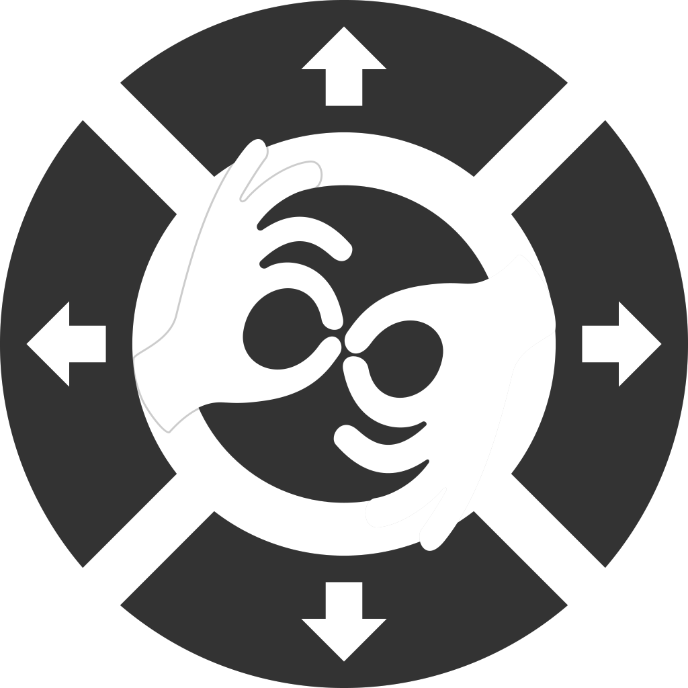

***

<h1 align="center">

    

 

    SmartHands

</h1>

a tool for VRCSDK3A avatars that allows greater sign language capability using puppets

***

## Installation

SmartHands always targets the latest version of VRCSDK3A. This means, to use it, you must have a Unity project on the [currently supported Unity version for VRChat](https://docs.vrchat.com/docs/current-unity-version), with the [latest version of SDK3 - Avatars](https://vrchat.com/home/download) installed.

Once you have this set up, you can download the latest SmartHands package from the [releases](https://github.com/Gorialis/vrchat-smarthands/releases) page, and import the unitypackage.

**Please make an active effort to keep SmartHands up to date.** This project constitutes a continuous effort to try and improve the scope of sign language within VRChat. It will be updated in the interests of language accuracy, Unity user experience, and usability within VRChat.

## Usage

1. First, inside the scene with your avatar, create an empty object in your Hierarchy by right clicking in the empty space and choosing "Create Empty".

    

2. Rename your object by selecting it and pressing F2. The name of the object itself does not matter, but for clarity, I recommend calling it `SmartHandsSettings`.

    

3. With your object selected, in the Inspector on the right, click "Add Component".

    

4. Click "Devon's Toolbox" and then "HH Smart Hands" (you can also just type 'Smart Hands' in the search).

    

5. The custom inspector for Smart Hands will display. Inside the 'Avatar' slot, click and drag in your avatar object (the one with the avatar descriptor).

    

6. Once your avatar is selected, the full Smart Hands settings will display. If you have multiple avatars in your scene, you will need multiple settings objects. From this point, the component itself will display any errors or warnings related to your setup.

## License

The code for SmartHands and its related documentation, as provided in this repository, is licensed under the [MIT License](LICENSE).

Multimedia assets (images, animation files, etc.) are licensed under [CC BY-SA 4.0](https://creativecommons.org/licenses/by-sa/4.0/).

## Additional contributors

- Korea_Yujin (Korean Sign Language animations)
- Shawarmachine (testing, feedback)
- SaikoArt_Finn (testing, feedback)
- HoH Mikka (testing, feedback)
